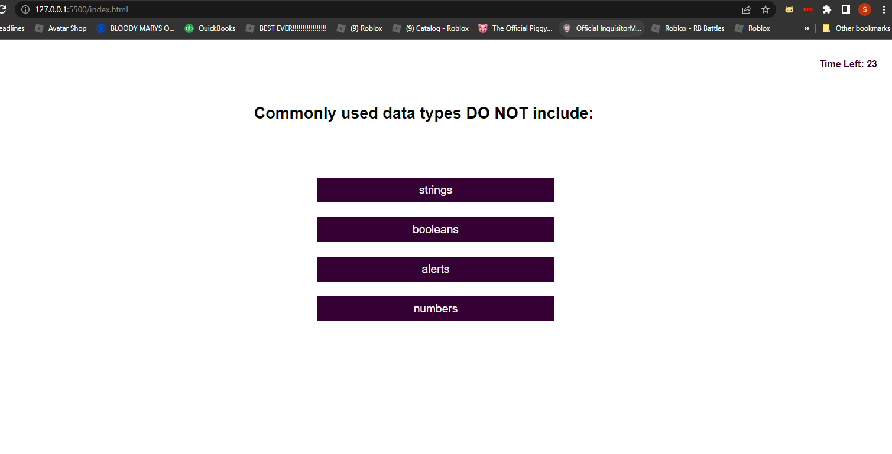

# Week 4 Challenge: JavaScript Quiz
## Description
The goal of this challenge was to create a quiz app using mainly Javascript.  The quiz needed to have a timer that starts when a button is clicked and for the question and answer choices to be displayed.  If a question was answered incorrectly, then some time needed to come off the clock. When the game is over, the app should let me entire my initials and see my score.
## The challenge of this Challenge
I found this challenge very difficult but I enjoyed trying to figure it out on my own as much as possible.  Rather than try to find functions I might need online and copy them, I really tried to use elements from many options I found and try to see what works best for me. I feel I was successful with some but not others.
## Criteria Met (and not)
The quiz I made has a working timer and fills in the current question and answer in their spots, and moves to the next when a choice is clicked, but I'm not sure if my scoring mechanic works correctly, and I did not get to the results and saving the initials phase.  This challenge is not where I'd like it to be but I feel good about the work I did complete and what I learned along the way.
## Link to Deployed Application
## Screenshot

## References
I looked at stackOverflow so much I might have put too many ideas together with some of my functions!
## Shout Out
Thank you to my tutor Phil Loy (https://calendly.com/fsf-tutor-team/phillip-loy?month=2023-01), he helped me get a few things working I was stuck on, I wish I had him for longer.